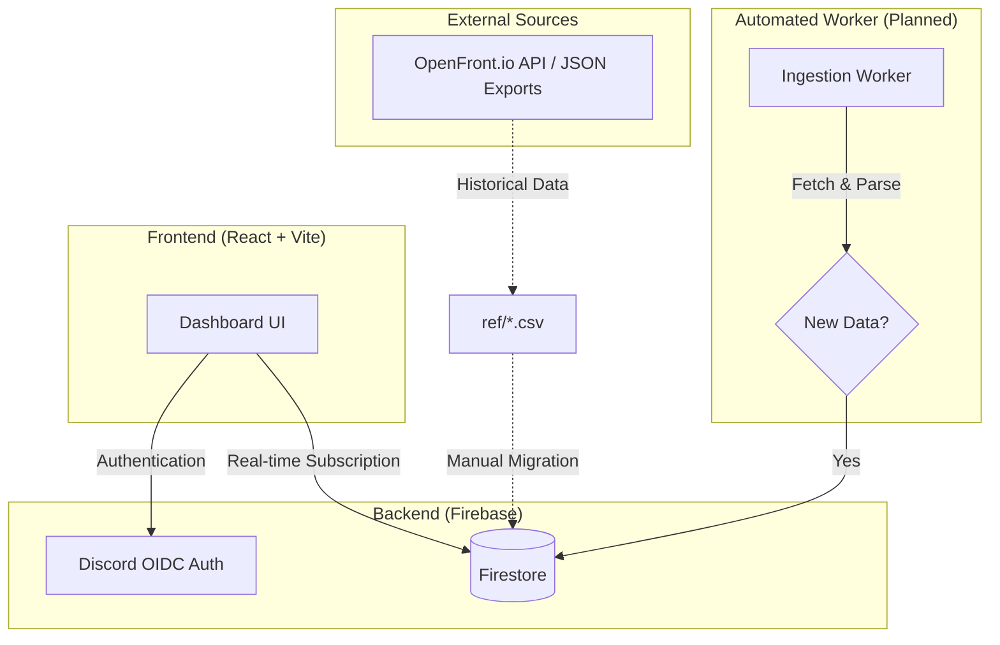

# Front-Nexus Architecture Reference

Front-Nexus is a high-performance statistics dashboard for OpenFront.io. This document outlines the system data flow and worker architecture.

## System Overview

## Data Lifecycle

1.  **Ingestion**: A worker (GitHub Action or Cloud Function) periodically fetches the latest game results and player snapshots from the OpenFront API.
2.  **Processing**: The worker calculates ELO changes and K/D updates based on match results.
3.  **Persistence**: Updated stats are pushed to Firestore collections: `players`, `clans`, and `matches`.
4.  **Consumption**: The React frontend uses Firestore listeners to provide instant leaderboard updates without page refreshes.

## Key Boundaries

- **Security**: Database access is controlled via Firestore Security Rules; client-side logic is for UX only.
- **Mocking**: The application includes a fallback mode that uses local mock data if Firebase environment variables are missing, facilitating development without a live connection.
